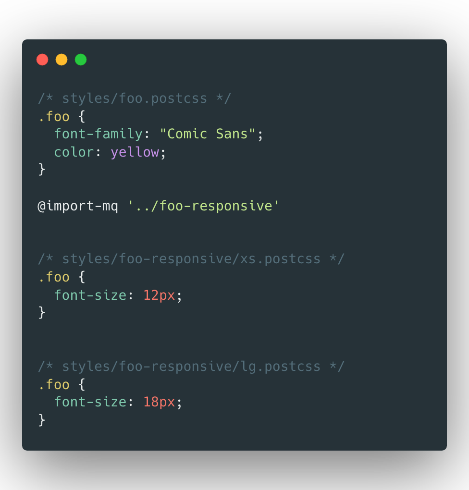
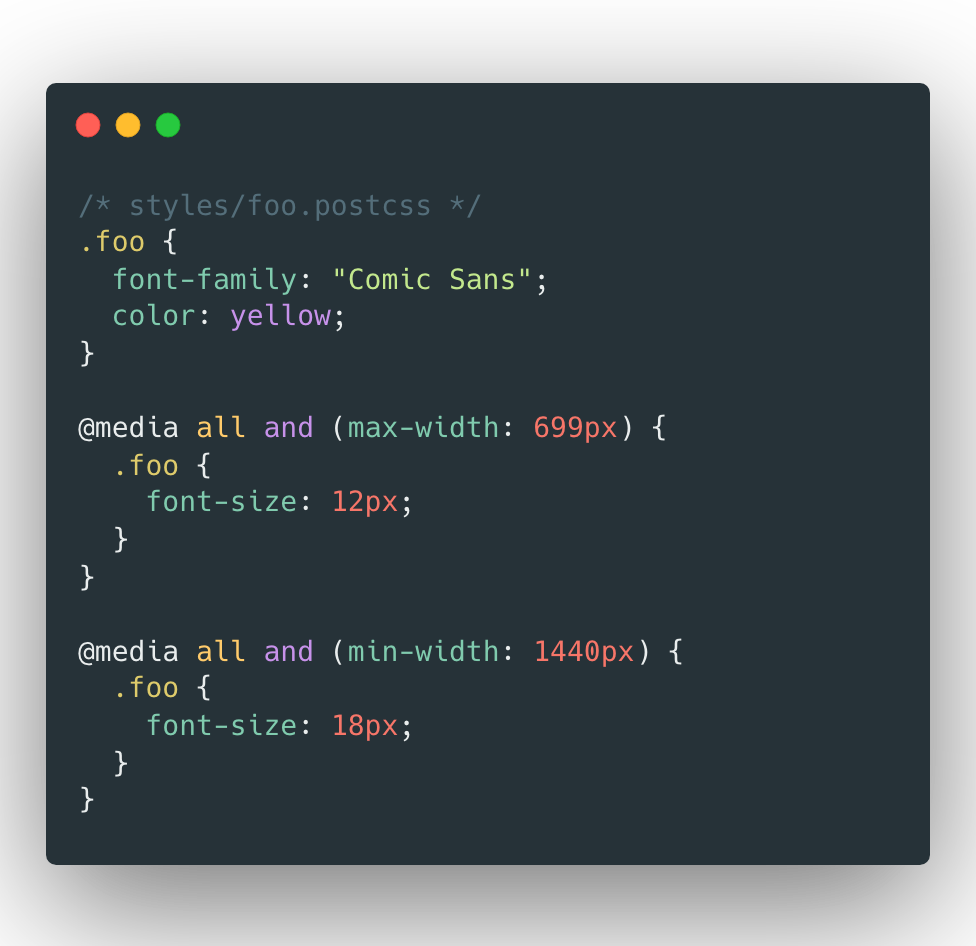
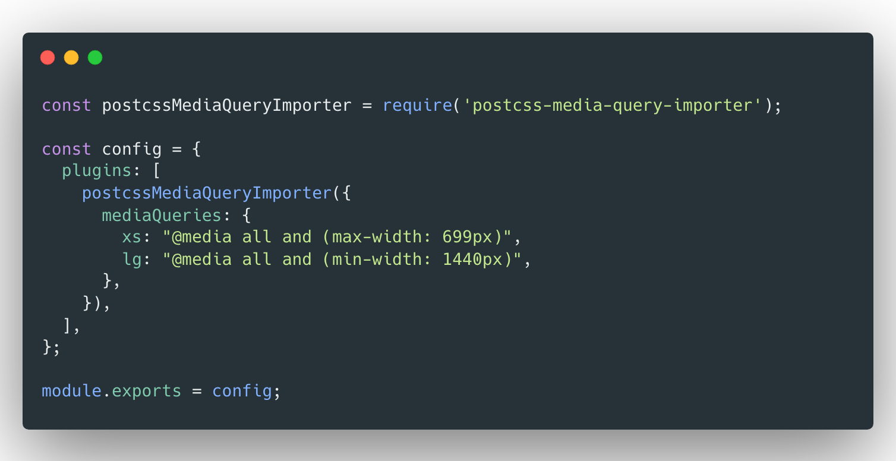

# postcss-media-query-importer

A [PostCSS](https://github.com/postcss/postcss) plugin to easily manage media queries in your project. Define media queries and corresponding filenames in the plugin options. Then use `@import-mq '[path-to-folder]'` anywhere in your css.
<br/>

### To-Do

| Status | Task | Priority |
| --- | --- | --- |
| ❌ | Example project files | **HIGH** |
| ❌ | Option to merge queries when no file present | **LOW** |
| ❌ | Fix Tests | **HIGH** |
| ❌ | Add parsing for media queries ranges | **LOW** |
| ✅ | Update Docs | **HIGH** |
| ✅ | [Indexing option for imports](/docs/ImportSettings.md#index) | **HIGH** |
| ✅ | [Parse aliases from urls](/docs/ImportSettings.md#aliases) | **HIGH** |
| ✅ | [Import aliases from config](/docs/PluginOptions.md#aliasconfigpath) | **HIGH** |

<br/>

### <a id="example"></a> Simple Example

| Input | Output |
| ------------- | ------------- |
|  |  |



Postcss-media-query-importer can also include an "index" file when importing. See [configuration](#configuration) for more details.

## <a id="installation"></a> Usage & Installation

**Step 1:** Install the plugin:

```sh
npm install --save-dev postcss postcss-media-query-importer
```

**Step 2:** Add the plugin to plugins list and define your project media queries:

```diff
+ const postcssMediaQueryImporter = require('postcss-media-query-importer')

module.exports = {
  plugins: [
    require('autoprefixer'),
+    postcssMediaQueryImporter(
+       ...options  
+    ),
  ]
}
```

**Step 3:** In any postcss file or postcss <style\> tag, use `@import-mq 'path/to/folder'`.
<br/>The path can either be relative to the current file, or relative to the project root directory.

---

## Configuration

### <a href="/docs/PluginOptions.md">Plugin Options</a>
- [mediaQueries](/docs/PluginOptions.md#mediaqueries): Define media queries and the associated file names.
- [aliasConfigPath](/docs/PluginOptions.md#aliasConfigPath): File to import url aliases from.
- [defaultImportSettings](/docs/PluginOptions.md#defaultImportSettings): Override default values for [Import Settings](/docs/ImportSettings.md).

### <a href="/docs/ImportSettings.md">Import Settings</a>
- [index](/docs/ImportSettings.md#index): Import an additional folder index file along with media queries
- [aliases](/docs/ImportSettings.md#aliases): Define aliases to be parsed out of import urls